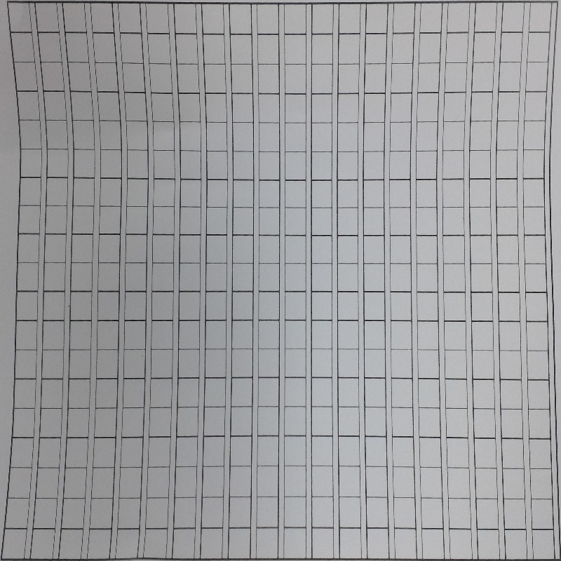

# paper-sheet-detection

This code can scan a curved edge paper and transfer it into a rectangle sheet.

Let's consider following document.

And

        

         

        
Original Image

Its edge is curved. Usually the software(IOS, Android) would use circumscribed quadrilateral to approximate the border, and then use warp perspection to transfer the image to a rectangle. This kind of effect is following:

<figure>

</figure>

<\center>
